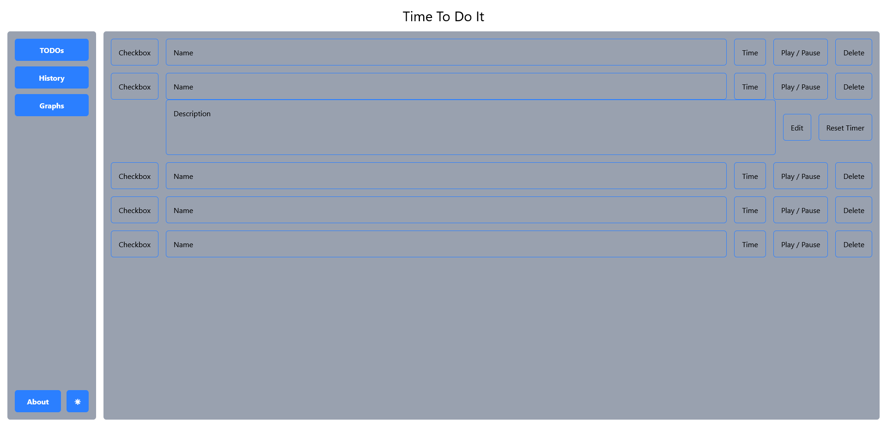

# ⏰ Time To Do It

A simple, elegant To-Do app to **track your tasks** and **measure the time** you spend on each one. Built with TypeScript.

---

## ✨ Features

- 📋 Add, edit, and delete to-dos
- ⏱️ Start/stop a timer for each task
- 📊 See how much time you spend on each to-do
- 🟢 Clean, intuitive interface

---

## 🚀 Getting Started

```bash
git clone https://github.com/yourusername/time-to-do-it.git
cd time-to-do-it
npm install
npm start
```

---

## 🛠️ Built With

- [TypeScript](https://www.typescriptlang.org/)
- [Vite](https://vite.dev/)
- [React](https://react.dev/)
- [Tailwindcss](https://tailwindcss.com/)

---

## 📸 Screenshots



---

## 📄 License

MIT

---

> Stay productive and mindful of your time with **Time To Do It**!